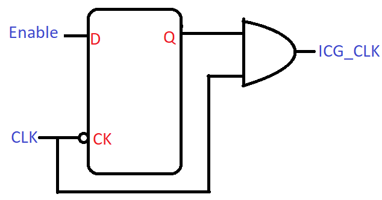
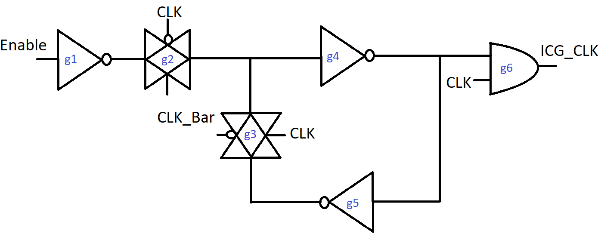
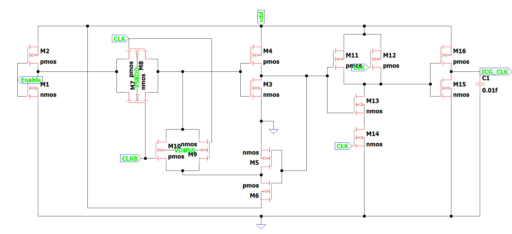
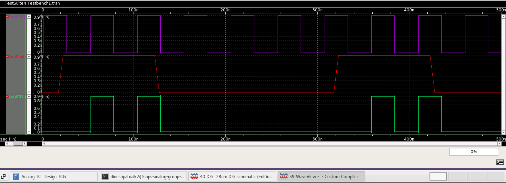

# Latch-based-Integrated-Clock-Gating-Cell
The purpose of this Hackathon is to implement the proposed design in 28 nm PDK (Process Design Kit).

This is a Report Submission for successful completion of Latch-based-Integrated-Clock-Gating-Cell simulating the proposed circuit as a result of literature survey conducted, for  [Cloud Based Analog IC Design Hackathon](https://www.iith.ac.in/events/2022/02/15/Cloud-Based-Analog-IC-Design-Hackathon/)

## Table of Contents
1. [Introduction](#introduction)
2. [Working](#working)
3. [Reference Circuit](#reference-circuit)
4. [Implementation](#implementation)
5. [Schematic Netlist](#schematic-netlist)
6. [Simulation result](#simulation-result)
- [Methodology](#methodology)
- [Challenge](#challenge)
- [Troubleshooting](#troubleshooting)
- [Reproduce_waveforms](#reproduce_waveforms)
- [Limitations](#limitations)
- [References](#references)
- [Acknowledgements](#acknowledgements)
- [Author](#author)

## Introduction

Now a days in ASIC design there are billions of cells due to which power becomes a crucial factor in determining the quality of a chip. Due do this huge no of cells, there’s a high switching activity of clock, which consumes a lot of dynamic power. So, in order to reduce dynamic power consumption in chip, one of the techniques used is clock gating. For instance If the flops work based on enable signal there is no need of providing each and every pulse of clock, instead of that we provide a selective pulse to flop which reduces the switching factor of clock.

## Working

This circuit is a Latch based Integrated Clock gating cell (ICG), which produces a clock pulse only whenever a high enable signal is encountered. 2 Transmission gates (2 PMOS, 2 NMOS), 3 Inverters (3 PMOS, 3 NMOS) and 1 AND gate (3 PMOS, 3 NMOS), are used to construct this circuit. To implement negative Dlatch, Transmission gates logic is used. Simply this circuit comprise of negative Dlatch and And gate.
Here when CLK is 0, Enable is (0,1), g1 is ON and output from g1 is (1,0), g2 passes (1,0), output from g4 is (0,1), output of g5 is (1,0), g3 is OFF and will not allow any signal to pass through it, output of g6 is 0 (i.e., ICG_CLK = 0), now when CLK is 1, Enable is (0,1), g1 is OFF and will not allow any signal to pass through it, now g3 is ON now it will pass previously store inverted value, now the output from g4 is non-inverted value now output of g6 is inverted value (i.e., ICG_CLK = Enable)

<p align="center">
	 
	<h5 align="center">Figure 1: Latch based ICG</h5>
</p>

In summary when CLK = 0, Dlatch is enabled hence output from Dlatch will change as per enable signal, due to AND gate, the output of ICG = 0 as one of input of AND is 0, When CLK = 1, Dlatch is disabled hence output will be of previous stored value as one of input of AND is 1.
This circuit arrangement is also min pulse width violation free as compared to only AND based clock gating. Latch based clock gating passes one complete cycle of clock whenever the enable signal is High and stops cycle for which enable signal is low.


## Reference Circuit

<p align="center">
	 
	<h5 align="center">Figure 2: Gate level schematic</h5>
</p>

<p align="center">
	 
	<h5 align="center">Figure 3: Transistor level schematic</h5>
	</p>

## Implementation

- Integrated clock gating is implemented by using Inverter, AND and Transmissiongate.
- The Aspect ratio(W/L) of pMOS is 0.03um/0.24um &  nMOS is 0.03um/0.12um
- Total transistors used = 18 (9 nMOS & 9 pMOS).
- The MOSFET model chosen is TT model from 28nm PDK.

## Schematic Netlist

The final netlist is as follows: 

```
*  Generated for: PrimeSim
*  Design library name: ICG_28nm
*  Design cell name: ICG_tb
*  Design view name: schematic
.lib 'saed32nm.lib' TT

*Custom Compiler Version S-2021.09
*Sun Feb 20 02:10:22 2022

.global gnd!
********************************************************************************
* Library          : ICG_28nm
* Cell             : INV
* View             : schematic
* View Search List : hspice hspiceD schematic spice veriloga
* View Stop List   : hspice hspiceD
********************************************************************************
.subckt inv a vdd vss y
xm0 y a vdd vdd p105 w=0.24u l=0.03u nf=1 m=1
xm1 y a vss vss n105 w=0.12u l=0.03u nf=1 m=1
.ends inv

********************************************************************************
* Library          : ICG_28nm
* Cell             : TG
* View             : schematic
* View Search List : hspice hspiceD schematic spice veriloga
* View Stop List   : hspice hspiceD
********************************************************************************
.subckt tg a b bbar y
xm2 a bbar y a p105 w=0.24u l=0.03u nf=1 m=1
xm1 a b y a n105 w=0.12u l=0.03u nf=1 m=1
.ends tg

********************************************************************************
* Library          : ICG_28nm
* Cell             : AND
* View             : schematic
* View Search List : hspice hspiceD schematic spice veriloga
* View Stop List   : hspice hspiceD
********************************************************************************
.subckt and a b out vdd vss
xm1 net17 b vdd vdd p105 w=0.24u l=0.03u nf=1 m=1
xm0 net17 a vdd vdd p105 w=0.24u l=0.03u nf=1 m=1
xm4 net17 a net19 net19 n105 w=0.12u l=0.03u nf=1 m=1
xm5 net19 b vss vss n105 w=0.12u l=0.03u nf=1 m=1
xi6 net17 vdd vss out inv
.ends and

********************************************************************************
* Library          : ICG_28nm
* Cell             : ICG
* View             : schematic
* View Search List : hspice hspiceD schematic spice veriloga
* View Stop List   : hspice hspiceD
********************************************************************************
.subckt icg clk enable icg_clk vdd vss
xi6 clk vdd vss net20 inv
xi2 net24 vdd vss net19 inv
xi1 net13 vdd vss net24 inv
xi0 enable vdd vss net16 inv
xi4 net19 clk net20 net13 tg
xi3 net16 net20 clk net13 tg
xi5 net24 clk icg_clk vdd vss and
.ends icg

********************************************************************************
* Library          : ICG_28nm
* Cell             : ICG_tb
* View             : schematic
* View Search List : hspice hspiceD schematic spice veriloga
* View Stop List   : hspice hspiceD
********************************************************************************
xi0 clk enable icg_out net6 gnd! icg
v2 net6 gnd! dc=0.9
v4 enable gnd! dc=0 pulse ( 0 0.9 18n 5n 5n 100n 300n )
v3 clk gnd! dc=0 pulse ( 0 0.9 2n 20p 20p 25n 51n )
c5 icg_out gnd! c=0.01f

.tran '50n' '500n' name=tran

.option primesim_remove_probe_prefix = 0
.probe v(*) i(*) level=1
.probe tran v(clk) v(enable) v(icg_out)

.temp 25

.option primesim_output=wdf

.option parhier = LOCAL

.end
```

- Netlist is generated by using Custom Compiler.


## Simulation result

- Custom Compiler Waveform

<p align="center">
	 
	<h5 align="center">Figure 4: Waveform</h5>
</p>.

## References

- [Synopsys solvnet documentation ](https://spdocs.synopsys.com/dow_retrieve/latest/dg/dcolh/Content/pwcug/pdf/pwcug.pdf)

- [A Novel Glitch-Free Integrated Clock Gating Cell for High Reliability - Emre Salman](https://www.researchgate.net/publication/332810977_A_Novel_Glitch-Free_Integrated_Clock_Gating_Cell_for_High_Reliability)

- [Signoff Semi blog](http://www.signoffsemi.com/synthesis/)

## Acknowledgements

- [Kunal Ghosh](https://github.com/kunalg123), Founder, VSD Corp. Pvt. Ltd
- [Indian Institute Of Technology (IIT), Hyderabad](https://iith.ac.in/)
- [Synopsys](https://www.synopsys.com/)

## Author

[Dinesh Patnaik](https://github.com/dineshp999),Bachelor of Technology in Electronics and Communication Engineering
